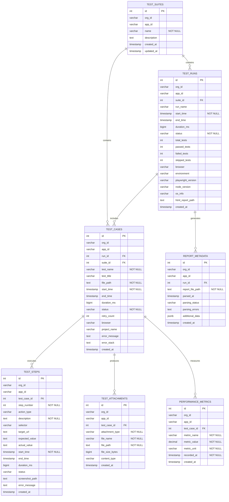

# Entity Relationship Diagram - Playwright Test Results Database

## Database Schema Overview

This PostgreSQL database is designed to store comprehensive Playwright test execution data and metrics. The schema follows a hierarchical structure from test suites down to individual test steps and attachments.

## Entity Relationship Diagram



## Entity Descriptions

### 1. **TEST_SUITES**
- **Purpose**: Logical grouping of related tests
- **Key Fields**: `name`, `description`
- **Relationships**: Parent to test runs and test cases

### 2. **TEST_RUNS**
- **Purpose**: Represents a single execution session of tests
- **Key Fields**: `start_time`, `end_time`, `status`, test counts, environment info
- **Relationships**: Belongs to a suite, contains multiple test cases

### 3. **TEST_CASES**
- **Purpose**: Individual test case execution records
- **Key Fields**: `test_name`, `file_path`, `status`, timing, error details
- **Relationships**: Belongs to a suite and run, contains steps, attachments, and metrics

### 4. **TEST_STEPS**
- **Purpose**: Detailed logging of individual test actions
- **Key Fields**: `action_type`, `description`, `selector`, validation values
- **Relationships**: Belongs to a test case

### 5. **TEST_ATTACHMENTS**
- **Purpose**: Files generated during test execution (screenshots, videos, traces)
- **Key Fields**: `attachment_type`, `file_path`, `file_size_bytes`
- **Relationships**: Belongs to a test case

### 6. **PERFORMANCE_METRICS**
- **Purpose**: Performance measurements collected during test execution
- **Key Fields**: `metric_name`, `metric_value`, `metric_unit`
- **Relationships**: Belongs to a test case

### 7. **REPORT_METADATA**
- **Purpose**: Information about HTML report parsing and processing
- **Key Fields**: `report_file_path`, `parsing_status`, `additional_data` (JSONB)
- **Relationships**: Belongs to a test run

## Key Relationships

1. **One-to-Many Hierarchical Structure**:
   ```
   TEST_SUITES (1) → TEST_RUNS (many) → TEST_CASES (many) → TEST_STEPS (many)
   ```

2. **Test Case Dependencies**:
   - Each `TEST_CASE` can have multiple `TEST_STEPS`, `TEST_ATTACHMENTS`, and `PERFORMANCE_METRICS`
   - Each `TEST_CASE` belongs to both a `TEST_SUITE` and a `TEST_RUN`

3. **Multi-tenancy Support**:
   - All tables include `org_id` and `app_id` for organization and application-level separation

## Status Values

- **TEST_RUNS**: `'running'`, `'passed'`, `'failed'`, `'interrupted'`
- **TEST_CASES**: `'passed'`, `'failed'`, `'skipped'`, `'timedout'`
- **TEST_STEPS**: `'passed'`, `'failed'`, `'warning'`

## File Types

- **TEST_ATTACHMENTS**: `'screenshot'`, `'video'`, `'trace'`, `'log'`

This schema provides comprehensive tracking of Playwright test execution from high-level suite organization down to individual step-level details, performance metrics, and file attachments.

---

## Alternative ASCII ER Diagram

If the Mermaid diagram above doesn't render, here's a text-based representation:

```
┌─────────────────┐    ┌─────────────────┐    ┌─────────────────┐
│   TEST_SUITES   │    │   TEST_RUNS     │    │  REPORT_METADATA│
│                 │    │                 │    │                 │
│ • id (PK)       │◄───┤ • id (PK)       │◄───┤ • id (PK)       │
│ • org_id        │    │ • org_id        │    │ • org_id        │
│ • app_id        │    │ • app_id        │    │ • app_id        │
│ • name          │    │ • suite_id (FK) │    │ • run_id (FK)   │
│ • description   │    │ • run_name      │    │ • report_path   │
│ • created_at    │    │ • start_time    │    │ • parsed_at     │
│ • updated_at    │    │ • end_time      │    │ • status        │
└─────────────────┘    │ • duration_ms   │    └─────────────────┘
         │              │ • status        │
         │              │ • total_tests   │
         │              │ • passed_tests  │
         │              │ • failed_tests  │
         │              │ • browser       │
         │              │ • environment   │
         │              └─────────────────┘
         │                       │
         │                       │
         └───────────────────────┼─────────────────────┐
                                 │                     │
                                 ▼                     ▼
                    ┌─────────────────┐    ┌─────────────────┐
                    │   TEST_CASES    │    │   TEST_CASES    │
                    │                 │    │                 │
                    │ • id (PK)       │    │ • id (PK)       │
                    │ • org_id        │    │ • org_id        │
                    │ • app_id        │    │ • app_id        │
                    │ • run_id (FK)   │    │ • suite_id (FK) │
                    │ • suite_id (FK) │    │ • test_name     │
                    │ • test_name     │    │ • file_path     │
                    │ • test_title    │    │ • status        │
                    │ • file_path     │    │ • duration_ms   │
                    │ • status        │    │ • browser       │
                    │ • error_msg     │    └─────────────────┘
                    └─────────────────┘              │
                             │                       │
                             ├───────────────────────┘
                             │
                    ┌────────┼────────┬────────────────────┐
                    │        │        │                    │
                    ▼        ▼        ▼                    ▼
          ┌─────────────┐ ┌─────────────┐ ┌─────────────┐ ┌─────────────┐
          │ TEST_STEPS  │ │TEST_ATTACH. │ │PERFORMANCE_ │ │             │
          │             │ │             │ │  METRICS    │ │             │
          │• id (PK)    │ │• id (PK)    │ │• id (PK)    │ │             │
          │• test_case  │ │• test_case  │ │• test_case  │ │             │
          │  _id (FK)   │ │  _id (FK)   │ │  _id (FK)   │ │             │
          │• step_number│ │• attachment │ │• metric_name│ │             │
          │• action_type│ │  _type      │ │• metric_val │ │             │
          │• description│ │• file_name  │ │• metric_unit│ │             │
          │• selector   │ │• file_path  │ │• recorded_at│ │             │
          │• status     │ │• file_size  │ └─────────────┘ │             │
          └─────────────┘ └─────────────┘                 │             │
                                                          │             │
                                                          └─────────────┘

Legend:
  PK = Primary Key
  FK = Foreign Key  
  ◄── = One-to-Many Relationship
```

## Online Diagram Viewers

You can also copy the Mermaid code and paste it into these online viewers:
- [Mermaid Live Editor](https://mermaid.live/)
- [Mermaid.js.org Editor](https://mermaid.js.org/intro/)

## VS Code Extensions for Diagrams

```vscode-extensions
bierner.markdown-mermaid,vstirbu.vscode-mermaid-preview,mermaidchart.vscode-mermaid-chart,dineug.vuerd-vscode
```